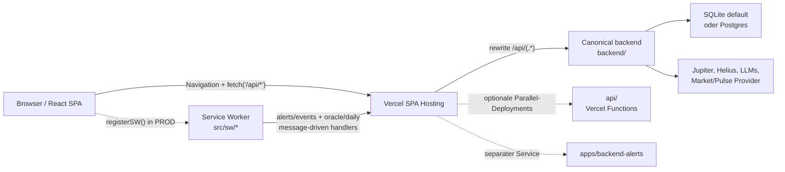
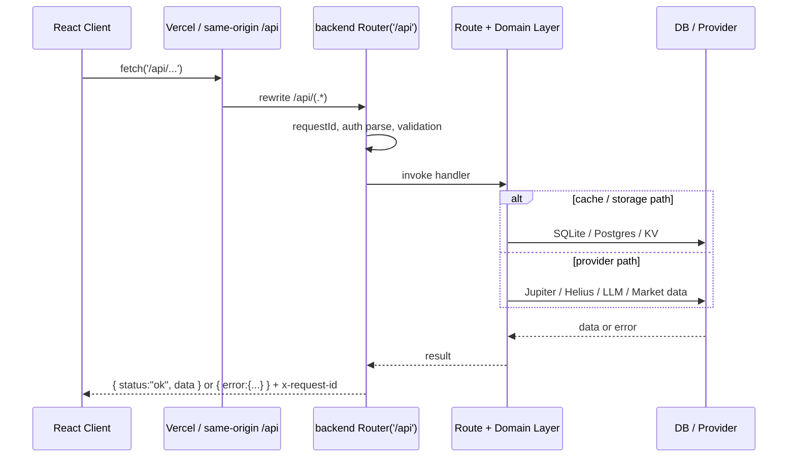
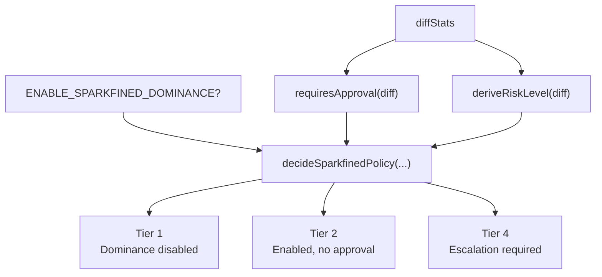
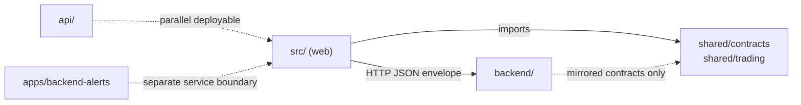
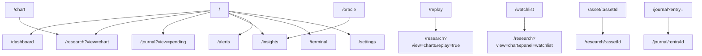

# Sparkfined — System Architecture

Zweck: **Code schneller verstehen**, **Fehler schneller debuggen**, **Dominance-Layer korrekt anwenden**.  
Scope: **Ist-Zustand** (keine Roadmap).

## 1) High-Level System Overview

### Web-App (Vite/React SPA)
- **Code**: `src/`
- **Routing/Layout**: React Router unter einer AppShell (Navigation + `Outlet`).
- **API Access**: zentral über `src/services/api/client.ts` mit kanonischem Envelope `{ status: "ok", data }`.
- **Service Worker**: Registrierung in Production via `src/main.tsx`; Handler in `src/sw/*` reagieren auf Nachrichten, deduplizieren in IndexedDB und zeigen Notifications an.

### Backend (canonical)
- **Code**: `backend/`
- **Runtime-Modell**: Always-on Node HTTP Server mit Basisrouter `/api`.
- **Persistence**: SQLite default (Dev/CI), Postgres optional via `DATABASE_URL`.
- **Jobs**: Scheduler + Cleanup für Alerts, Oracle und TA-Cache.

> Parallel-Implementierungen (nicht canonical in Production, solange `vercel.json` alle `/api/*` Requests umschreibt):
> - `api/`: Vercel Functions Alternative
> - `apps/backend-alerts/`: separater Alerts-Service mit eigener Railway-Konfiguration

### Shared Contracts
- **Cross-package Contracts**: `shared/contracts/*` und `shared/trading/*`.
- **Frontend Contracts**: `src/types/*` für UI-boundaries.
- **Backend kann `shared/` nicht direkt importieren**; notwendige Contracts werden gespiegelt, z. B. Dominance in `backend/src/lib/dominance/contracts.ts`.

### Dominance Layer (Governance + Quality Gates)
- **Code**: `backend/src/lib/dominance/*`
- **Aufgabe**: Risiko-Policy, Autonomy-Tiers, Golden Tasks, Auto-Correct Loop, Trace/Cost Layer, Memory Artifacts.
- **Aktivierung**: runtime flag `ENABLE_SPARKFINED_DOMINANCE=true`.

## 2) Data Flow Diagram

**Observed:** Der Worker ist aktuell **message-driven**. Die Poll-Handler in `src/sw/service-worker.ts` laufen erst, wenn der Worker `SW_TICK`-Nachrichten erhält.

## 3) Request Lifecycle (canonical)

1. **Client config**:
   - Dev: `apiClient` nutzt `/api` und damit den Vite-Proxy.
   - Prod: Default ist same-origin root; Requests auf `/api/*` werden von Vercel umgeschrieben.
   - `credentials`: `same-origin` default, `include` nur wenn `VITE_ENABLE_AUTH="true"`.
2. **HTTP boundary**: JSON + Envelope, keine TypeScript-Imports über die Laufzeitgrenze.
3. **Backend router**: Request Context, `x-request-id`, optionales JWT-Parsing, Zod-Validierung.
4. **Domain execution**: Repos/Services + optionale Provider-Calls mit Budget-/Tier-Gating.
5. **Response**:
   - Success: `{ "status": "ok", "data": ... }`
   - Error: `{ "error": { "code": "...", "message": "...", "details": { ... } } }`

## 4) Golden Task System (Dominance)

Definition: **deterministische Qualitäts-Gates** als Befehlsliste.

- **Global Suite**:
  - `npm run lint`
  - `npx tsc --noEmit`
  - `npm run build`
  - `npm run test:backend`
  - `npm run test:e2e`
- **Subset Planning**:
  - `backend_only`: lint + tsc + test:backend
  - `frontend_only`: lint + tsc + build
  - `ci_deploy`: globale Suite
  - `llm_router_or_adapters`: lint + tsc + build + test:backend

## 5) Risk Policy Flow (Dominance)

Approval-Reasons (exakt): `core_engine`, `adapters`, `ci_deploy`, `large_diff`.

Max Auto-Fix Iterations:
- `critical`: 3
- `high`: 4
- sonst: 5

## 6) Feature Flag Behavior

| Flag | Ort | Default | Effekt |
|---|---|---:|---|
| `VITE_ENABLE_AUTH` | Frontend build-time | false | `credentials="include"`; SW/Client behandeln 401/403 nur dann als authRequired |
| `VITE_ENABLE_DEV_NAV` | Frontend build-time | false | Dev-Navigation sichtbar/unsichtbar |
| `VITE_RESEARCH_EMBED_TERMINAL` | Frontend build-time | false | Embedded Terminal im Research-Workspace aktiv |
| `VITE_SENTRY_DSN` | Frontend build-time | unset | Initialisiert Sentry in `src/lib/monitoring/sentry.ts` |
| `ENABLE_SPARKFINED_DOMINANCE` | Backend runtime | false | Dominance Policy/Tracing/Memory/Golden Tasks aktiv |
| `LLM_TIER_DEFAULT` | Backend runtime | `free` | Default Tier für kosten-/fähigkeitsabhängige Endpoints |
| `ONCHAIN_TUNING_PROFILE` | Backend runtime | `default` | Onchain gating / confidence tuning |

## 7) Dependency Model

Rules:
- API boundary is JSON + envelopes, not TS imports.
- Shared contracts are **additive-only** unless version-bumped.

## 8) Routing Architecture

### Canonical Primary Routes
- `/dashboard`
- `/research?view=chart&q=<ticker|solanaBase58>`
- `/research/:assetId`
- `/journal?view=pending|confirmed|archived`
- `/journal/:entryId`
- `/insights`
- `/insights/:insightId`
- `/alerts`
- `/terminal`
- `/settings`

### Legacy Redirects
- `/chart` → `/research?view=chart`
- `/replay` → `/research?view=chart&replay=true`
- `/watchlist` → `/research?view=chart&panel=watchlist`
- `/oracle` → `/insights`
- `/asset/:assetId` → `/research/:assetId`
- `/journal?entry=<id>` → `/journal/:entryId`
- `/learn` → `/journal?view=pending&mode=learn`
- `/handbook` → `/journal?view=pending&mode=playbook`
- `/settings/providers|data|privacy|experiments` → `/settings?section=...`

## 9) Reasoning Layer

**Purpose:** LLM-powered reasoning for trade review, session review, board scenarios, routing and ad-hoc execution.

**Code:** `backend/src/routes/reasoning/*`, `backend/src/routes/reasoningRoute.ts`, `backend/src/routes/llm.ts`, parallele `api/reasoning/*`-Implementierungen.

**Routes:**
- `POST /api/reasoning/trade-review`
- `POST /api/reasoning/session-review`
- `POST /api/reasoning/board-scenarios`
- `POST /api/reasoning/insight-critic`
- `POST /api/reasoning/route`
- `POST /api/llm/execute`

**Characteristics:**
- Strict JSON outputs validated against Zod schemas
- Last valid insights cached client-side for offline-first flows
- Insight Critic als separater finaler Safety Step

## 10) Deployment Model

### Frontend (Vercel)
- Build: `pnpm run build`, Output `dist/`
- Routing: SPA fallback rewrite auf `/index.html`
- API: `/api/*` rewrite auf `https://$VERCEL_BACKEND_URL/api/$1`
- SW caching headers: `sw.js` / `service-worker.js` mit `max-age=0, must-revalidate`

### Backend (external host, canonical)
- Start: `node dist/server.js` nach `pnpm -C backend build`
- DB: `DATABASE_URL` steuert SQLite vs. Postgres
- Migrations: `pnpm -C backend migrate`

### Parallel Deployables
- `api/`: Vercel Functions Backend, separat deploybar, aber nicht canonical für dieses Frontend
- `apps/backend-alerts/`: separater Alerts-Service mit eigener Railway-Konfiguration
