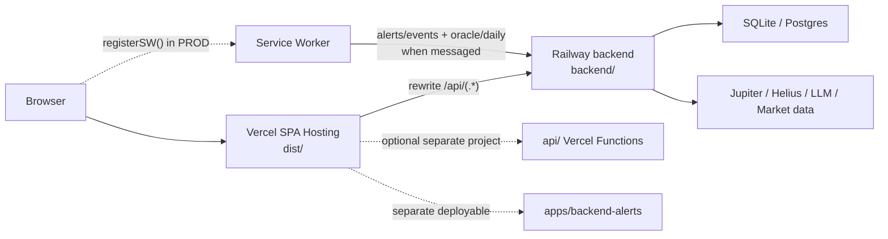

# Deployment

**Last Updated:** 2026-05-16

---
## Production Routing (Frontend)

**Source:** `vercel.json`

- Frontend is deployed as a Vite SPA.
- Build command: `pnpm run build`
- Output directory: `dist`
- Production rewrite: `/api/(.*)` → `https://$VERCEL_BACKEND_URL/api/$1`
- All other paths rewrite to `/index.html`

**Consequence:** Production API traffic from the SPA always targets same-origin `/api/*` and is server-side rewritten to the canonical backend.

## Backend Hosting (Railway)

**Source:** `railway.toml`

- Deploys `backend/` as Docker service:
  - Dockerfile: `backend/Dockerfile`
  - Start: `node dist/backend/src/server.js`
  - Healthcheck: `/api/health`
- Root directory: `backend`
- Builder: Docker

This is an always-on Node process, not a serverless deployment.

## Backend Hosting (Fly.io Alternative)

**Source:** `fly.toml` (repo root)

- Deploys the canonical `backend/` via Dockerfile (`backend/Dockerfile`)
- HTTP Health Check: `GET /api/health`
- Runs as always-on service (`min_machines_running = 1`, `auto_stop_machines = "off"`)
- Uses persistent volume mount for SQLite: `/app/backend/.data`

### Minimal Setup

1. Install and authenticate:
   - `fly auth login`
2. Create app (or adjust `app` in `fly.toml` first):
   - `fly apps create <unique-app-name>`
3. Create persistent volume (same region as `primary_region`):
   - `fly volumes create backend_data --region <region> --size 5`
4. Set required secrets/env:
   - `fly secrets set JWT_SECRET="<>=32chars" HELIUS_API_KEY="<...>" REDIS_URL="<...>"`
   - `fly secrets set BACKEND_CORS_ORIGINS="https://<frontend-domain>"`
5. Deploy:
   - `fly deploy --ha=false`

### Single-Instance Requirement

- Wegen in-memory Discover Cache und internen Scheduler-Jobs muss das Backend aktuell als **eine Instanz** laufen.
- Auf Fly: initial mit `fly deploy --ha=false` und danach bei Bedarf explizit auf 1 Maschine halten:
  - `fly scale count 1`

---

## Additional Deployables

### `apps/backend-alerts/`
- separate service with its own `apps/backend-alerts/railway.toml`
- start command: `pnpm start`
- health check: `/health`

### `api/` (Vercel Functions Backend)
- implemented in the repo
- deployable as a separate Vercel project
- not canonical for this frontend while the root `vercel.json` owns `/api/*`

## Guardrails Against API Drift

**Source:** `scripts/verify-vercel-api-ownership.mjs`

Policy:
- no relative `/api/*` rewrite destinations in production
- no `/api` rewrite exceptions
- `api/` ownership must stay explicit and mechanically verifiable

Goal:
- prevent mixed ownership such as “half external backend, half Vercel Functions”

## Local vs Production Differences

| Topic | Local | Production |
|-------|-------|------------|
| API Routing | Vite Proxy `/api` → `http://localhost:3000` | Vercel Rewrite `/api/(.*)` → `https://$VERCEL_BACKEND_URL/api/$1` |
| Backend Runtime | `backend/` Node server via `pnpm -C backend dev` | External hosted Node server (Railway oder Fly.io) |
| Service Worker | not registered | registered via `virtual:pwa-register` |
| SW Data Fetching | not active | handler exists, but polling remains message-driven (`SW_TICK`) |

**Observed:** The current repo does **not** reference a `VITE_ENABLE_SW_POLLING` flag. Production SW registration is unconditional; actual polling depends on worker messages.

## Feature Flags

### `VITE_RESEARCH_EMBED_TERMINAL`
- default: `false`
- enables the Embedded Terminal inside Research

### `VITE_SENTRY_DSN`
- default: unset
- initializes Sentry in production and development-safe no-op mode otherwise

### Other runtime flags
See `shared/docs/ENVIRONMENT.md` for the full matrix.

## Monitoring & Error Tracking

### Sentry Integration
- initialized in `src/lib/monitoring/sentry.ts`
- tagged with current route and the `VITE_RESEARCH_EMBED_TERMINAL` flag
- browser tracing + replay enabled when DSN is configured
- expected offline fetch failures are filtered before send

## Pre-Beta Hardening

### Error Boundaries
- global app boundary
- dedicated Terminal boundary
- dedicated Discover boundary
- guarded Embedded Terminal inside Research

### Safety Warnings
- slippage warning above 5%
- priority fee warning above 50k microLamports
- both remain informational, not blocking

## Environment Variables

Key deployment variables:
- `VERCEL_BACKEND_URL`
- `VITE_RESEARCH_EMBED_TERMINAL`
- `VITE_SENTRY_DSN`
- `VITE_SOLANA_CLUSTER`
- `VITE_SOLANA_RPC_URL`

See [Environment](../shared/docs/ENVIRONMENT.md) for details.

## Health Checks

**Backend**
- `/api/health`
- used by Railway deployment health verification
- `/api/health/ready`
- verifies database readiness and optional KV availability
- `/api/health/upstreams`
- monitoring-only provider preflight; reports Jupiter reachability, Jupiter platform fee account configuration, and Helius availability without exposing secret values

**Frontend**
- no dedicated health endpoint
- SPA rewrite serves all client routes through `index.html`

## Related Documentation

- [Architecture](./ARCHITECTURE.md) - System architecture
- [Environment](../shared/docs/ENVIRONMENT.md) - Complete env var list
- [Security](./SECURITY.md) - Security constraints
