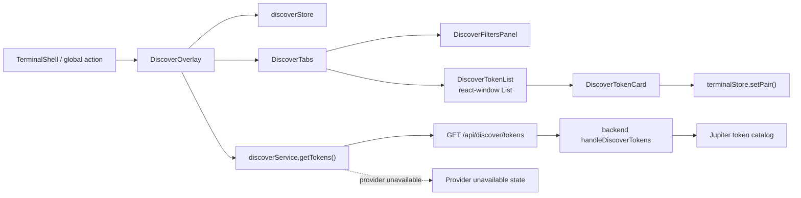
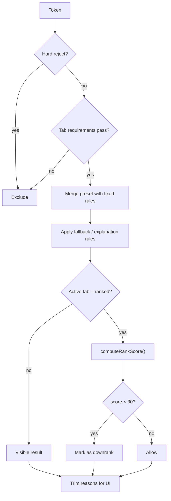

# Discover Overlay

**Implementation Status:** ✅ Phase 2 Complete

## Overview

The Discover Overlay provides token discovery with:
- tab-specific filter rules and presets
- ranking for the `ranked` tab
- memoized evaluation and virtualized rendering
- direct handoff into Terminal pair selection

**Access:**
- Terminal: Discover button in `TerminalShell`
- Global: `useDiscoverStore().openOverlay()`

## Architecture



### Components

**DiscoverOverlay** (`src/components/discover/DiscoverOverlay.tsx`)
- Vaul drawer with 90vh height
- fetches token data on open
- keeps rendering entirely client-side

**DiscoverTabs** (`src/components/discover/DiscoverTabs.tsx`)
- tabs: `not_bonded`, `bonded`, `ranked`
- resets each tab to its default preset on tab switch
- lays out filters left and the token list right

**DiscoverFiltersPanel** (`src/components/discover/DiscoverFiltersPanel.tsx`)
- launchpad multi-select
- time window selector
- min-liquidity filter
- search input
- preset selector per active tab

**DiscoverTokenList** (`src/components/discover/DiscoverTokenList.tsx`)
- uses `react-window` `List`
- measures container height dynamically
- renders evaluated token rows only for visible items plus overscan

**DiscoverTokenCard** (`src/components/discover/DiscoverTokenCard.tsx`)
- symbol, name, liquidity, volume, holders, launchpad, reason chips
- optional score badge on ranked results
- click action hands the token to Terminal and closes the overlay

### State Management

**DiscoverStore** (`src/lib/state/discoverStore.ts`)
- overlay state: `isOpen`, `activeTab`
- filter state: `filters`, `selectedPreset`
- data state: `tokens`, `isLoading`, `error`
- actions: `retryFetch()`, `resetFilters()`, open/close/tab changes

## Filter Engine



### Presets
- `not_bonded`: `bundler_exclusion_gate`
- `bonded`: `strict_safety_gate`
- `ranked`: `signal_fusion`

**Merge rule:** fixed rules stay active; stricter preset thresholds win on conflicts.

## Ranking System

- Score range: `0-100`
- Implemented via `computeRankScore()` in `src/features/discover/filter/scoring.ts`
- Inputs include liquidity, activity, holder concentration, safety signals and optional social/oracle signals
- `ranked` results below 30 are still shown, but explicitly downranked

## Integration

### Terminal → Discover
- Discover button calls `useDiscoverStore().openOverlay()`
- overlay opens without route change or reload

### Discover → Terminal
- clicking a token calls `terminalStore.setPair()`
- quote mint is pinned to the default USDC quote asset
- overlay closes after the pair handoff
- Terminal quote fetching starts automatically via store debounce

## Data Source

**Current Implementation**
- `discoverService.getTokens()` calls `/api/discover/tokens`
- canonical backend route: `backend/src/routes/trading.ts -> handleDiscoverTokens`
- backend builds a cached deterministic catalog from the Jupiter token list
- backend fail-closed behavior: provider failure returns `503 PROVIDER_UNAVAILABLE`
- frontend has no runtime mock fallback for discover tokens

**Endpoint Contract**
```text
GET /api/discover/tokens
Query: limit?, cursor?
Response: Token[]
Header: x-next-cursor when pagination continues
Error: 503 { error: { code: "PROVIDER_UNAVAILABLE", details: { provider: "jupiter" } } }
```

## Performance

- Memoized selectors via `createDiscoverTokenSelector()`
- Virtualized rendering via `react-window`
- Dynamic height measurement via `ResizeObserver`
- Current implementation is comfortable for 200+ visible candidates and supports paging up to the backend cap

## Testing Checklist

1. Overlay Behavior:
   - overlay opens and closes without page reload
   - ESC / outside click / close button all dismiss the drawer
   - token click sets the pair and closes the overlay

2. Tabs and Presets:
   - each tab restores its default preset on tab change
   - ranked tab shows score badges

3. Data Paths:
   - successful `/api/discover/tokens` response renders live rows
   - failed provider response renders a provider-unavailable state with retry
   - successful empty array response renders an empty list state without synthetic rows

4. Performance:
   - long lists remain scrollable without layout thrash
   - filter changes re-evaluate rows without blocking the drawer

## Known Limitations

1. **Data is deterministic, not market-native alpha**
   The canonical backend currently seeds Discover from the Jupiter token catalog plus generated metrics.

2. **Discover is provider-dependent**
   When Jupiter is unavailable, the route fails closed with `503 PROVIDER_UNAVAILABLE`.

3. **Terminal handoff assumes a default quote asset**
   Discover always routes selected tokens into the default USDC quote pair.

## Related Documentation

- [Terminal](./TERMINAL.md)
- [Architecture](./ARCHITECTURE.md)
- [QA](./QA.md)
