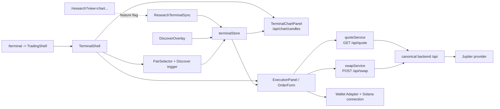
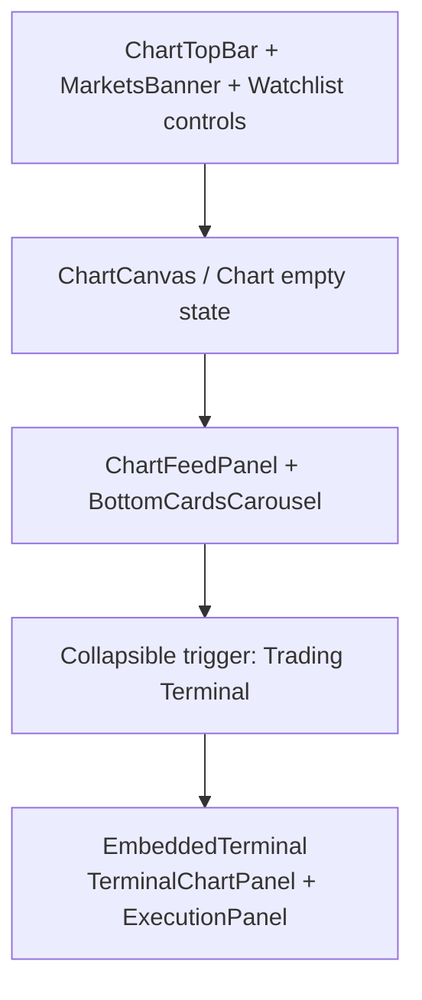
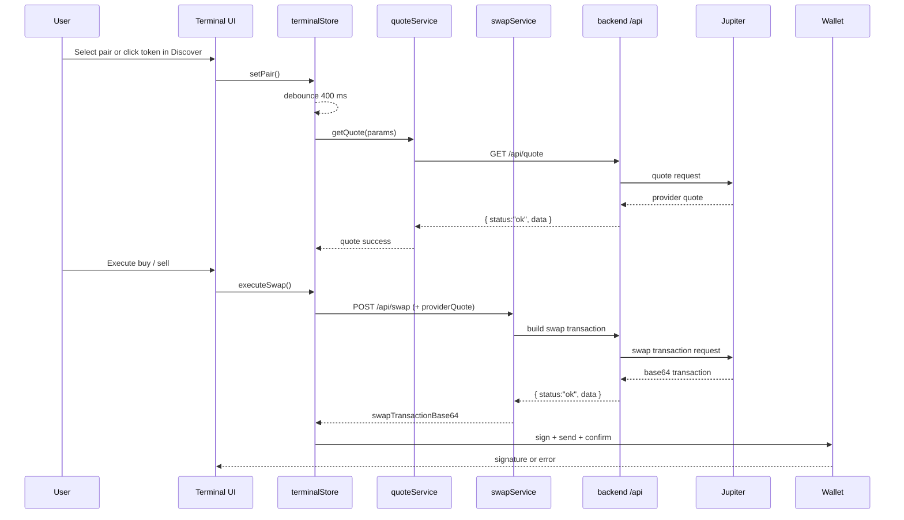

# Trading Terminal

**Implementation Status:** ✅ Phase 1 Complete + Research Integration (Feature-Flagged)

## Overview

The Trading Terminal provides non-custodial Solana swap execution with:
- Jupiter integration for quote + swap building
- Fee engine with tier-based reduction
- Race-safe quote fetching
- Stale quote protection
- Safety warnings for slippage and priority fee

**Routes:**
- Standalone: `/terminal`
- Embedded in Research: `/research?view=chart...` when `VITE_RESEARCH_EMBED_TERMINAL="true"`

## Architecture



### Components

**TerminalShell** (`src/components/terminal/TerminalShell.tsx`)
- Top bar with `WalletMultiButton`, `PairSelector` and Discover trigger.
- Main layout: `ChartPanel` + `ExecutionPanel`.
- Global `TxStatusToast` for send/confirm feedback.

**ExecutionPanel** (`src/components/terminal/ExecutionPanel.tsx`)
- Hosts `OrderForm`, fee preview, warnings and execute action.
- Reads and mutates `terminalStore`.

**TerminalChartPanel** (`src/components/terminal/TerminalChartPanel.tsx`)
- Loads candles from `GET /api/chart/candles`.
- Surfaces provider-unavailable and empty-data states without generating fallback candles.
- Passes render state into `ChartPanel`.

**ChartPanel** (`src/components/terminal/ChartPanel.tsx`)
- Uses `lightweight-charts`.
- Renders only caller-provided candle data.
- Shows state cards for no pair, loading, empty data, and provider errors.

**EmbeddedTerminal** (`src/components/terminal/EmbeddedTerminal.tsx`)
- Reuses the same store and execution logic as standalone Terminal.
- Removes the top bar and is wrapped by a `Collapsible` in Research.
- Layout is `flex-col` on mobile and `flex-row` on desktop.

### State Management

**TerminalStore** (`src/lib/state/terminalStore.ts`)
- Core inputs: `pair`, `side`, `amount`, `slippageBps`, `priorityFee`, `feeTier`
- Derived/runtime state: `quote`, `tx`, `balances`
- Key actions: `setPair()`, `setSide()`, `setAmountValue()`, `fetchQuote()`, `executeSwap()`, `fetchBalances()`

**Quote Fetch Strategy**
- `requestId` sequencing drops out-of-order responses.
- `scheduleQuoteFetch()` debounces requests by 400 ms.
- Successful quotes expire after 25 seconds.
- `executeSwap()` snapshots the current inputs before requesting or reusing a quote.

## Research Integration

### Feature Flag

**`VITE_RESEARCH_EMBED_TERMINAL`** (default: `false`)
- `true`: Research renders a collapsible Embedded Terminal below the chart workspace.
- `false`: Terminal remains available only at `/terminal`.

### One-Way Sync

**ResearchTerminalSync** (`src/components/Research/ResearchTerminalSync.tsx`)
- Syncs `selectedSymbol` from Research into `terminalStore.setPair()`.
- Uses `resolveSymbolToMint()` and skips unresolved or already-synced pairs.
- Current well-known mint coverage is intentionally limited.

### Research Layout



**Observed:** The Research terminal drawer is **closed by default** and only rendered when the feature flag is enabled.

## Execution Flow



## Fee Engine

### Fee Tiers

| Tier | Fee (bps) | Description |
|------|-----------|-------------|
| free | 65 | Default tier |
| soft | 55 | Soft lock tier |
| hardI | 40 | Hard lock tier I |
| hardII | 30 | Hard lock tier II |
| genesis | 20 | Genesis tier |

**Current Implementation**
- Frontend starts with `free` tier.
- Backend may reduce the effective fee tier based on lock status.
- Fee calculation uses integer math and rounds down.

```typescript
feeAmount = (notionalBaseUnits * feeBps) / 10000n
```

## Safety Features

### Slippage Warning
- Threshold: `> 500` bps (5%)
- Non-blocking warning below the slippage selector

### Priority Fee Warning
- Threshold: `> 50_000` microLamports
- Non-blocking warning below the priority fee control

### Error Boundaries
- `TradingShell` wraps standalone Terminal in `ErrorBoundary`.
- Research embeds the terminal inside its own guarded surface.
- Reset closes overlays before re-render.

## API Endpoints

**Quote**
```text
GET /api/quote
Query: baseMint, quoteMint, side, amount, amountMode, slippageBps, feeBps, priorityFeeEnabled, priorityFeeMicroLamports
Response: TerminalQuoteData
```

**Swap**
```text
POST /api/swap
Body: { publicKey, baseMint, quoteMint, side, amount, amountMode, slippageBps, feeBps, priorityFee, providerQuote }
Response: { swapTransactionBase64, lastValidBlockHeight?, prioritizationFeeLamports? }
```

**Chart Candles**
```text
GET /api/chart/candles
Query: mint, quoteMint, timeframe, limit?
Response: { candles: InputCandle[] }
Error: 503 PROVIDER_UNAVAILABLE while live OHLCV provider is unconfigured
```

## Testing Checklist

1. Standalone Terminal:
   - Navigate to `/terminal`
   - Wallet connects successfully
   - Pair selector works
   - Discover overlay opens
   - Quote loads after pair selection

2. Research Integration (feature enabled):
   - Navigate to `/research?view=chart&q=SOL`
   - Open the Trading Terminal drawer
   - Confirm `SOL/USDC` sync via `ResearchTerminalSync`
   - Execute quote + swap flow without breaking `/terminal`

3. Safety and Error Handling:
   - Raise slippage above 5% and confirm warning
   - Enable high priority fee and confirm warning
   - Force an error path and verify boundary/reset behavior

## Known Limitations

1. **Chart provider is fail-closed**
   Terminal chart UI now consumes `/api/chart/candles` and does not synthesize candles. Until a live OHLCV provider is owner-approved and configured, the UI shows provider-unavailable or empty-data states.

2. **Symbol resolver is intentionally narrow**
   Embedded Research sync only resolves a well-known symbol subset.

3. **Fee tier selection is not user-configurable**
   Frontend defaults to `free`; higher tiers are backend-driven.

4. **Priority fee UI is coarse-grained**
   Users can enable priority fees, but there is no full expert editor for arbitrary microLamports values.

## Related Documentation

- [Architecture](./ARCHITECTURE.md)
- [Discover](./DISCOVER.md)
- [Deployment](./DEPLOYMENT.md)
- [Security](./SECURITY.md)
- [QA](./QA.md)
